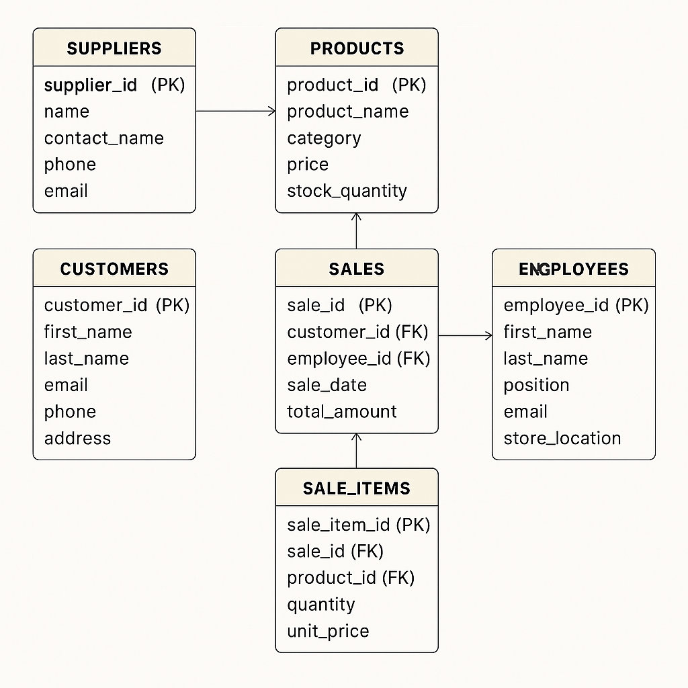

# GIBBS SOLUTIONS - Online Store Database Project

A cloud-based PostgreSQL database system built for a fictional retail company called **GIBBS SOLUTIONS**. This company specializes in selling computers, gadgets, and related accessories.

This project demonstrates my skills as an entry-level Database Administrator, showcasing real-world tasks like schema design, data insertion, query development, and analysis.

---

## 📈 Features
- PostgreSQL relational database design
- SQL schema creation using DDL
- Data population with realistic mock data (150+ records)
- Analytical queries and reports
- Clean folder organization and GitHub versioning

---

## 🧱 Technologies Used
- PostgreSQL 15
- SQL (DDL, DML, Joins, Aggregates)
- Linux (VMware environment)
- Git & GitHub

---

## 📄 Project Structure
```bash
gibbs-solutions-online-store-db/
├── README.md
├── USE_CASE.md
├── schema/
│   └── create_tables.sql
├── data/
│   └── insert_sample_data.sql
├── queries/
│   └── sample_reports.sql
├── images/
│   └── ERD.png
```

---

## 📚 Database Schema Overview
The system consists of six main tables:
- `suppliers`
- `products`
- `customers`
- `employees`
- `sales`
- `sale_items`

Each table is normalized and connected with proper foreign key constraints.

### 🔍 ERD


---

## 👨‍💼 Use Case
For a detailed breakdown of how the system works, including query results and insights:
> 📄 [USE_CASE.md](USE_CASE.md)

---

## 📕 Setup Instructions
1. Clone the repository:
```bash
git clone https://github.com/Gibson-Nwagboniwe/gibbs-solutions-online-store-db.git
cd gibbs-solutions-online-store-db
```

2. Run the schema file to create tables:
```bash
psql -U postgres -d your_database_name -f schema/create_tables.sql
```

3. Populate the database:
```bash
psql -U postgres -d your_database_name -f data/insert_sample_data.sql
```

4. Run analysis queries:
```bash
psql -U postgres -d your_database_name -f queries/sample_reports.sql
```

---

## 🌟 What I Learned
- How to design and normalize a relational schema
- Writing effective analytical SQL queries
- Using PostgreSQL on a Linux server
- Structuring a professional GitHub project

---

## 📊 Future Improvements
- Add indexes for performance tuning
- Create stored procedures and views
- Integrate a front-end dashboard (e.g. Metabase)
- Add triggers for stock notifications

---

## 🙌 Credits
This project was built as a portfolio piece to showcase my skills in database administration.
Feel free to explore, clone, and adapt it for learning purposes.

---

**GitHub:** [Gibson-Nwagboniwe](https://github.com/Gibson-Nwagboniwe)

